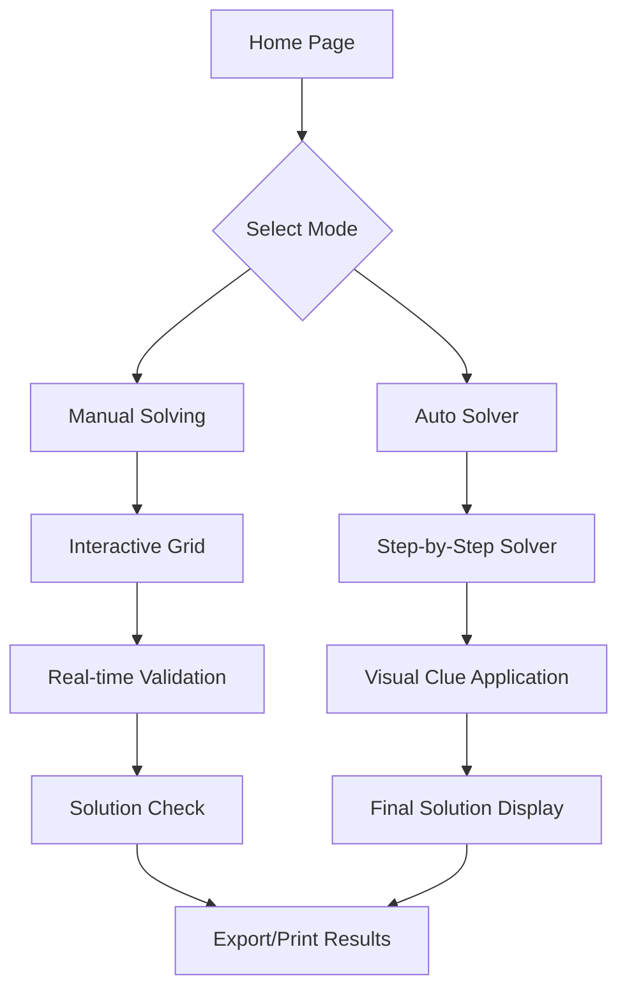

# Logic Puzzle Solver - Puzzle 1 Implementation

## Architecture Overview

## Core Components

### 1. Data Structure & Types (`src/types/puzzle.ts`)

Define TypeScript interfaces for:

- Students: Alice, Bob, Charlie, Dave, Eve
- Languages: Python, Java, C++, Ruby, Swift
- Problem Types: Math, Logic, Sorting, Graph
- Solution state matrix (Student x Language x Problems)
- Constraint representation for the 10 clues

### 2. Constraint Satisfaction Solver (`src/lib/solver.ts`)

Implement the core logic engine:

- Parse and encode all 10 clues as constraints
- CSP solver using backtracking with constraint propagation
- Arc consistency algorithm (AC-3) for pruning impossible assignments
- Return step-by-step solution path showing:
  - Which clue is applied
  - What assignments are made
  - What possibilities are eliminated

**Key clues to implement:**

1. Bob + Logic, Bob ≠ C++
2. Charlie = Swift + Graph
3. Python user = Math, ≠ Sorting
4. Alice = Math, ≠ Ruby/Swift
5. C++ user ≠ Logic/Graph
6. Eve = Sorting, ≠ Java/Python
7. Dave ≠ Graph, ≠ Ruby
8. Sorting solver also solves Logic
9. Only 2 students solve Graph
10. Java user solves exactly 2 problem types

### 3. UI Components (using Shadcn)

**Main Page** ([`src/app/page.tsx`](src/app/page.tsx)):

- Hero section explaining the puzzle
- Mode selector (Manual vs Auto-Solver)
- Display all 10 clues in an organized card layout

**Puzzle Grid Component** (`src/components/PuzzleGrid.tsx`):

- Interactive table with Students (rows) x Languages (columns)
- Each cell shows assigned problem types
- Color-coded states: confirmed (green), impossible (red), unknown (gray)
- Click handlers for manual assignment mode

**Solver Visualization** (`src/components/SolverVisualization.tsx`):

- Step-by-step display with "Next Step" / "Auto Play" buttons
- Highlight current clue being applied
- Animate the elimination/assignment process
- Progress indicator showing steps completed

**Solution Display** (`src/components/SolutionDisplay.tsx`):

- Final table showing complete solution
- Summary: Student → Language → Problem Types
- Export to PDF/Print functionality for submission

### 4. Manual Solving Mode

**Features:**

- Users can click cells to assign languages to students
- Checkboxes to mark which problems each student solves
- Real-time validation against constraints
- Visual feedback when constraints are violated
- Hint system: "Apply next clue" button that shows which clue to consider

**Validation Component** (`src/lib/validator.ts`):

- Check partial solutions against all 10 clues
- Highlight conflicts in red
- Show which constraint is violated

### 5. Auto-Solver Mode

**Step-by-Step Engine:**

- Start with empty grid
- Apply clues 1-10 in sequence (or optimal order)
- For each step, show:
  - Current clue text
  - Reasoning (e.g., "Since Bob solves Logic and doesn't use C++...")
  - Grid updates with animations
  - Remaining possibilities

**Animation Strategy:**

- Use Framer Motion or CSS transitions
- Fade in new assignments
- Cross out eliminated options
- Highlight affected cells

### 6. UI/UX Design (Shadcn Components)

Use these Shadcn components:

- **Card** - For clue display, info panels
- **Table** - For the main puzzle grid
- **Button** - Mode toggles, actions
- **Badge** - For language and problem type labels
- **Tabs** - Switch between Manual/Auto modes
- **Alert** - Show validation errors or success
- **Dialog** - Help modal explaining how to use the app
- **Progress** - Show solving progress

### 7. Styling & Responsiveness

- Modern, clean design with proper spacing
- Dark mode support (already configured)
- Mobile-responsive grid (may need horizontal scroll)
- Accessibility: keyboard navigation, ARIA labels

## Implementation Steps

**Phase 1: Core Logic** (Solver)

- Create types and interfaces
- Implement CSP solver with all 10 constraints
- Test solver independently to ensure correct solution
- Generate step-by-step solving trace

**Phase 2: UI Foundation**

- Build main page layout with mode selector
- Create PuzzleGrid component (read-only view first)
- Display the 10 clues in organized cards
- Implement SolutionDisplay component

**Phase 3: Auto-Solver Mode**

- Integrate solver with visualization component
- Add step navigation (prev/next/play/pause)
- Implement animations for grid updates
- Show reasoning text for each step

**Phase 4: Manual Mode**

- Make grid interactive (click to assign)
- Add real-time validation
- Implement hint system
- Add solution checker

**Phase 5: Polish & Export**

- Add help/tutorial modal
- Implement print/export functionality
- Test all edge cases
- Optimize performance and animations

## Expected Deliverables

For your assignment submission:

1. **Working App** - Deployed or runnable locally
2. **Source Code** - Well-commented, following best practices
3. **Screenshots** - Show both manual and auto-solver modes in action
4. **Write-up** - Explain the CSP algorithm, constraint encoding, and solving strategy

## Technologies Used

- **Next.js 16** - React framework with App Router
- **React 19** - UI components
- **TypeScript** - Type safety for logic solver
- **Shadcn UI** - Beautiful, accessible components
- **Tailwind CSS** - Styling
- **Lucide Icons** - Visual icons

This plan creates an impressive, interactive system that satisfies all evaluation criteria: correctness (CSP solver), efficiency (constraint propagation), interactivity (dual modes), and clarity (step-by-step explanations).
