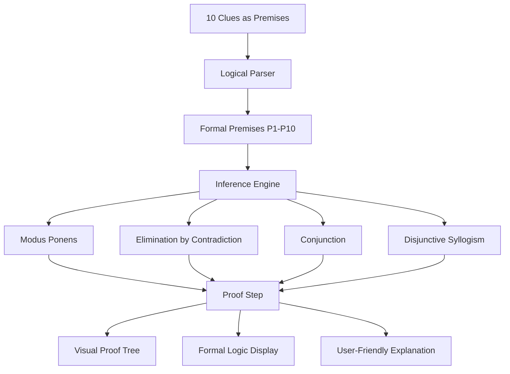

# Rules of Inference Refactoring Plan

## Overview

Transform the CSP solver into a **formal proof system** using Rules of Inference from discrete mathematics. This demonstrates CLO3: "Demonstrate personal skills in constructing formal proofs of validity."

## Architecture Changes



## Core Components to Refactor

### 1. Type System Updates (`src/types/puzzle.ts`)

**Add new types for formal logic:**

```typescript
// Inference Rules enumeration
export enum InferenceRule {
  MODUS_PONENS = "Modus Ponens",
  MODUS_TOLLENS = "Modus Tollens",
  ELIMINATION_BY_CONTRADICTION = "Elimination by Contradiction",
  CONJUNCTION = "Conjunction",
  DISJUNCTIVE_SYLLOGISM = "Disjunctive Syllogism",
  SIMPLIFICATION = "Simplification",
  RESOLUTION = "Resolution",
}

// Logical operators
export enum LogicalOperator {
  AND = "∧",
  OR = "∨",
  NOT = "¬",
  IMPLIES = "→",
  IFF = "↔",
}

// Formal premise structure
export interface FormalPremise {
  id: string; // P1, P2, ... P10
  clue: Clue;
  formalNotation: string; // e.g., "Bob → Logic ∧ ¬C++"
  naturalLanguage: string;
}

// Proof step with inference rule
export interface ProofStep {
  stepNumber: number;
  inferenceRule: InferenceRule;
  premises: string[]; // Which premises used (e.g., ["P1", "P2"])
  conclusion: string; // Formal notation of conclusion
  formalProof: string; // e.g., "P1, P2 ⊢ Alice → Python (MP)"
  naturalLanguage: string;
  action: SolverAction;
  stateAfter: PuzzleState;
}

// Proof tree node for visualization
export interface ProofNode {
  id: string;
  rule: InferenceRule;
  premises: ProofNode[];
  conclusion: string;
  step: ProofStep;
}
```

### 2. Formal Logic Parser (`src/lib/formalLogic.ts`)

**New file to convert clues to formal logical notation:**

```typescript
/**
 * Convert natural language clues to formal logical notation
 */
export function parseClueToFormalNotation(clue: Clue): FormalPremise {
  // Examples:
  // Clue 1: "Bob solves Logic but does not use C++"
  // → "Bob.solves(Logic) ∧ ¬Bob.uses(C++)"
  // Clue 2: "Charlie uses Swift and solves Graph"
  // → "Charlie.uses(Swift) ∧ Charlie.solves(Graph)"
  // Clue 10: "Java user solves exactly 2 problems"
  // → "∀x (x.uses(Java) → |x.problems| = 2)"
}

/**
 * Format conclusion in formal notation
 */
export function formatConclusion(action: SolverAction): string {
  // Convert actions to formal logic
}
```

### 3. Inference Engine Refactor (`src/lib/inferenceEngine.ts`)

**Replace `solver.ts` with formal inference engine:**

```typescript
/**
 * Apply Modus Ponens: P, P → Q ⊢ Q
 */
function applyModusPonens(
  premises: FormalPremise[],
  state: PuzzleState,
  steps: ProofStep[]
): PuzzleState {
  // Example:
  // P2: Charlie.uses(Swift) (given)
  // P_implied: Swift → Graph (from clue)
  // Conclusion: Charlie.solves(Graph) (by MP)
}

/**
 * Apply Elimination by Contradiction: Assume ¬P leads to contradiction ⊢ P
 */
function applyContradiction(
  premises: FormalPremise[],
  state: PuzzleState,
  steps: ProofStep[]
): PuzzleState {
  // Example:
  // Assume Dave doesn't use C++
  // But Alice→Python, Bob→¬C++, Charlie→Swift, Eve→¬Java∧¬Python
  // Only C++ left for Dave
  // Contradiction! Therefore Dave→C++
}

/**
 * Apply Conjunction: P, Q ⊢ P ∧ Q
 */
function applyConjunction(
  premises: FormalPremise[],
  state: PuzzleState,
  steps: ProofStep[]
): PuzzleState {
  // Combine multiple known facts
}

/**
 * Apply Disjunctive Syllogism: P ∨ Q, ¬P ⊢ Q
 */
function applyDisjunctiveSyllogism(
  premises: FormalPremise[],
  state: PuzzleState,
  steps: ProofStep[]
): PuzzleState {
  // Example:
  // Bob.uses(Python ∨ Java ∨ Ruby) (remaining options)
  // ¬Bob.uses(Python) (assigned to Alice)
  // ¬Bob.uses(Ruby) (Eve uses Ruby)
  // Therefore: Bob.uses(Java) (by DS)
}
```

### 4. UI Component Updates

**Update `SolverVisualization.tsx`:**

- Display inference rule name for each step
- Show formal notation alongside natural language
- Highlight premises used
- Add proof tree visualization component

**New component: `ProofStepDisplay.tsx`:**

```typescript
interface ProofStepDisplayProps {
  step: ProofStep;
  highlighted: boolean;
}

// Displays:
// 1. Inference Rule badge (color-coded)
// 2. Premises used (with references P1, P2, etc.)
// 3. Formal notation (with logical symbols)
// 4. Natural language explanation
// 5. Conclusion
```

**New component: `ProofTree.tsx`:**

```typescript
// Visual tree diagram showing:
// - Root: Final conclusion
// - Branches: Inference steps
// - Leaves: Original premises
// - Lines connecting premises to conclusions
```

**New component: `FormalProofPanel.tsx`:**

```typescript
// Side panel showing:
// - List of all premises (P1-P10)
// - Current derivation path
// - Proof summary in formal notation
```

### 5. Documentation Updates

**Update `PROJECT_WRITEUP.md`:**

- Section on Rules of Inference used
- Formal proof structure
- Mathematical notation explanation
- Proof tree diagrams
- Example formal proofs

**Add new file: `FORMAL_PROOF.md`:**

```markdown
# Formal Proof of Puzzle 1 Solution

## Premises (P1-P10)

P1: Bob.solves(Logic) ∧ ¬Bob.uses(C++)
P2: Charlie.uses(Swift) ∧ Charlie.solves(Graph)
...

## Derivation

1. Charlie.uses(Swift) [P2, Simplification]
2. Charlie.solves(Graph) [P2, Simplification]
3. Alice.solves(Math) [P4, Simplification]
   ...

## Inference Rules Applied

- Modus Ponens: 5 times
- Disjunctive Syllogism: 3 times
- Elimination by Contradiction: 2 times
- Conjunction: 4 times
```

## Implementation Steps

### Phase 1: Type System & Logic Parser

1. Add new types for inference rules and formal notation
2. Implement `formalLogic.ts` parser
3. Convert all 10 clues to `FormalPremise` objects
4. Test formal notation generation

### Phase 2: Inference Engine

1. Create `inferenceEngine.ts` with 4 main inference functions
2. Implement Modus Ponens rule
3. Implement Elimination by Contradiction
4. Implement Conjunction
5. Implement Disjunctive Syllogism
6. Add premise tracking to each step
7. Test each inference rule independently

### Phase 3: UI Updates

1.  Update `ProofStep` type in visualization
2.  Create `ProofStepDisplay` component with:

                                                - Inference rule badge (color-coded)
                                                - Formal notation display
                                                - Premise references
                                                - Natural language translation

3.  Add premise tracking highlights
4.  Update main visualization to show both formats

### Phase 4: Proof Tree Visualization

1. Create `ProofTree.tsx` component
2. Build tree structure from proof steps
3. Implement visual tree rendering (use Mermaid or D3.js)
4. Add interactive node exploration
5. Connect to main solver visualization

### Phase 5: Formal Documentation

1.  Generate formal proof writeup
2.  Update PROJECT_WRITEUP.md with:

                                                - Rules of Inference explanation
                                                - Formal proof section
                                                - Mathematical notation guide

3.  Add FORMAL_PROOF.md with complete derivation
4.  Include proof tree diagrams

### Phase 6: Testing & Validation

1. Verify all inference rules produce correct conclusions
2. Test formal notation accuracy
3. Validate proof tree structure
4. Check documentation completeness
5. Ensure backward compatibility with existing features

## Key Inference Rules Mapping

### 1. Modus Ponens (P → Q, P ⊢ Q)

**Example:**

- P: "Charlie uses Swift" (from clue 2)
- P → Q: "If someone uses Swift, then Swift is unavailable for others"
- Q: "Swift is unavailable for Alice, Bob, Dave, Eve"

### 2. Elimination by Contradiction (¬P leads to ⊥ ⊢ P)

**Example:**

- Assume: Dave doesn't use C++
- Known: Alice→Python, Charlie→Swift, Eve→Ruby, Bob→Java
- Result: No language left for Dave → Contradiction
- Therefore: Dave uses C++

### 3. Conjunction (P, Q ⊢ P ∧ Q)

**Example:**

- P: "Bob solves Logic" (from clue 1)
- Q: "Bob solves Graph" (from clue 9)
- P ∧ Q: "Bob solves Logic and Graph"

### 4. Disjunctive Syllogism (P ∨ Q, ¬P ⊢ Q)

**Example:**

- P ∨ Q: "Eve uses Ruby or C++ or Java" (remaining options)
- ¬(Java): "Eve doesn't use Java" (from clue 6)
- ¬(C++): "Dave uses C++" (already assigned)
- Therefore Q: "Eve uses Ruby"

## Visual Design

### Inference Rule Color Coding

- **Modus Ponens**: Blue (#3B82F6)
- **Elimination by Contradiction**: Red (#EF4444)
- **Conjunction**: Green (#10B981)
- **Disjunctive Syllogism**: Purple (#8B5CF6)

### Formal Notation Display

- Use monospace font for logical symbols
- Highlight operators (∧, ∨, ¬, →) in different colors
- Show premise references in brackets [P1, P2]
- Display turnstile (⊢) for derivations

## Benefits of This Refactoring

1. **Academic Rigor**: Demonstrates formal proof construction (CLO3)
2. **Educational Value**: Shows how discrete math applies to real problems
3. **Transparency**: Makes reasoning explicit and verifiable
4. **Documentation**: Provides formal proof for assignment submission
5. **Debugging**: Easier to verify correctness of each inference step

## Deliverables

- ✅ Refactored solver using formal inference rules
- ✅ UI showing both formal and natural language
- ✅ Proof tree visualization
- ✅ Premise tracking and highlighting
- ✅ Formal proof documentation (FORMAL_PROOF.md)
- ✅ Updated PROJECT_WRITEUP.md with inference rules
- ✅ All tests passing with new inference engine
